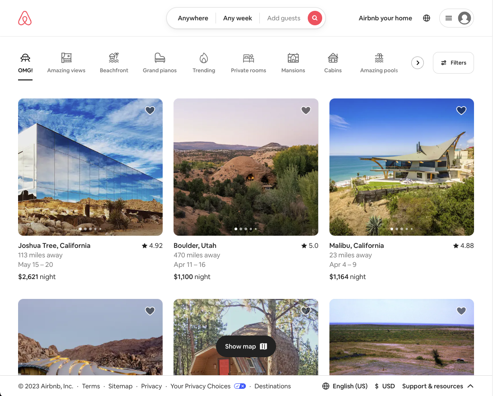
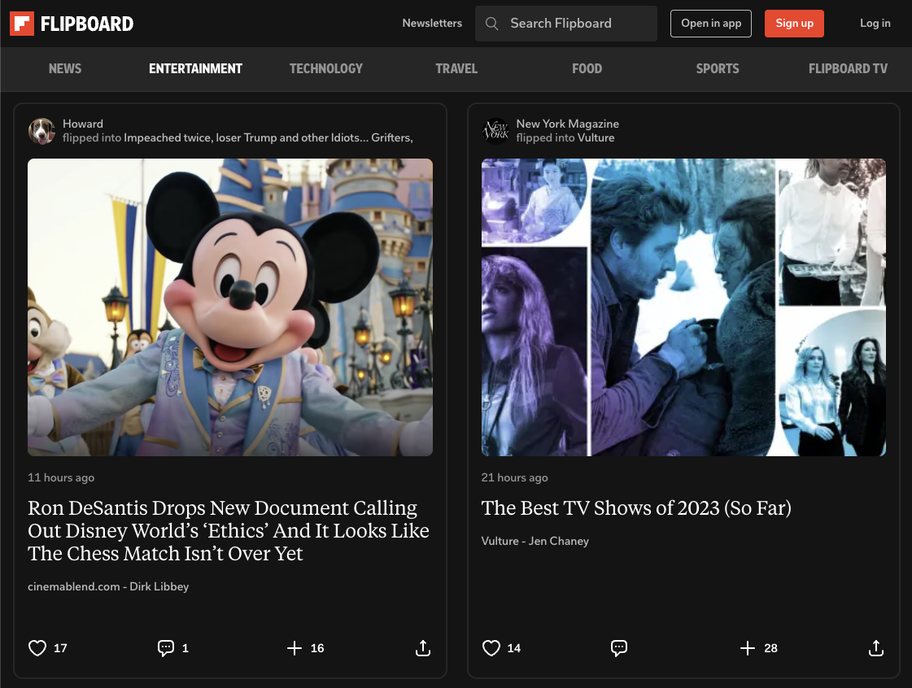

# Intro to React

## What is React?
Let's take a look at a couple of sites that use React.

### Airbnb.com

### Flipboard.com

Browsing these sites, we notice a few things. They feel very "reactive." Things happen instantly, you don't wait for new pages to load or actions to start. In fact, when we click a link, the page doesn't even seem to refresh.

Traditionally, in web applications, you click a link and wait for a new page to load. You click a button and wait for some action to complete.

With React, and with other front-end JavaScript frameworks, we do not have to wait.

You have already created projects that took advantage of this. In our Web Fundamentals stack, we learned that JavaScript is a programming language that allows us to run logic in the browser. It is able to manipulate the DOM. It allows us to change what the user sees without requesting a new HTML page from the server.

Since React is a JavaScript library, it can do that too. It does this by taking a declarative, component-driven approach to creating what are called, "single page applications".

## What is a Single Page Application (SPA)?

In a single-page application, one initial request is made to the server. The server responds with a single HTML page, and all the bundled JavaScript necessary to render the rest of the site.

The "single page" of a single-page application is literally the single index.html page we initially request from the server.

When the user clicks a link, it may look like they are navigating to another page on the site, but behind the scenes, JavaScript is manipulating the DOM to make it look that way.

The page does not refresh and reload with every clicked link or form submission. The user does not wait for another request-response cycle to complete.

This results in a more satisfying, responsive, and reactive experience for the user.